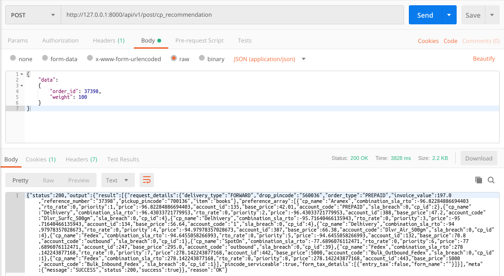

### README- cp_recommendation

#### Description-
- This API returns the Clickpost Recommendation of Courier Partners for any particular Pincode.
- Here we have to just pass- **Order_ID & Weight (in grams)** as input.
- Data is passed to the API in JSON by frontend application.
- POST Method used.

#### API Url-
- http://127.0.0.1:8000/cp_recommendation

#### Test Data-
	{
		"data":
		{
			"order_id": 1,
			"weight": 100
		}
	}    

#### Output-
- Postman Output

- MySQL Output

#### References-
- **One can also check with the Official Clickpost API for testing purpose.**
- **API URl**- *https://www.clickpost.in/api/v1/recommendation_api/?key=1e96edab-1b4b-440b-894f-63a2d42e2be0*
- **Test Data-**
*[{"pickup_pincode": "700136", "drop_pincode": "560036", "order_type": "PREPAID", "reference_number": "37398", "item": "books", "invoice_value": 197.0, "delivery_type": "FORWARD", "weight": 100}]*
- **Output**-

#### AUTHOR-
- **coded by AAYUSH GADIA** 
- **contact info: gadia.aayush@gmail.com**
