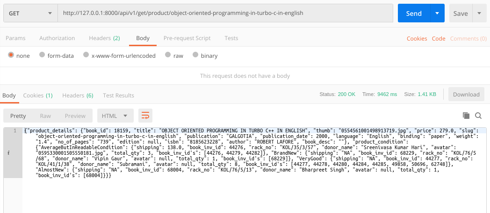
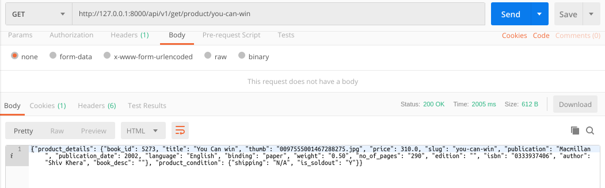
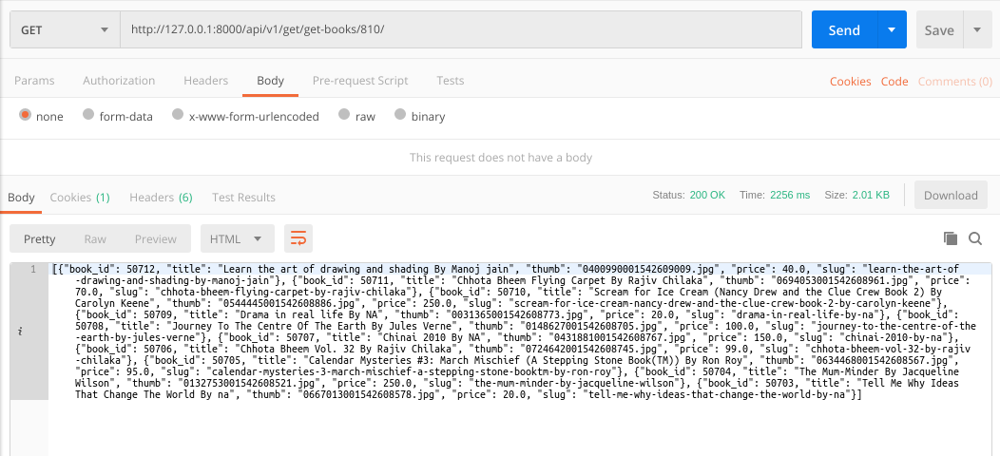
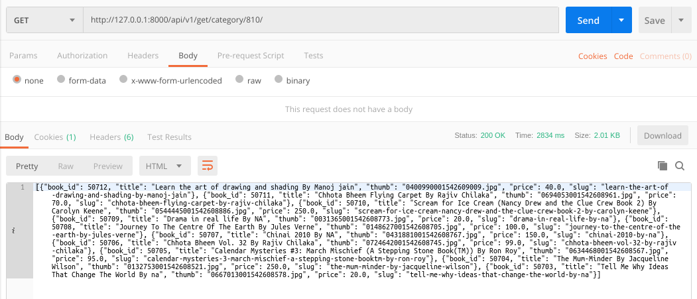
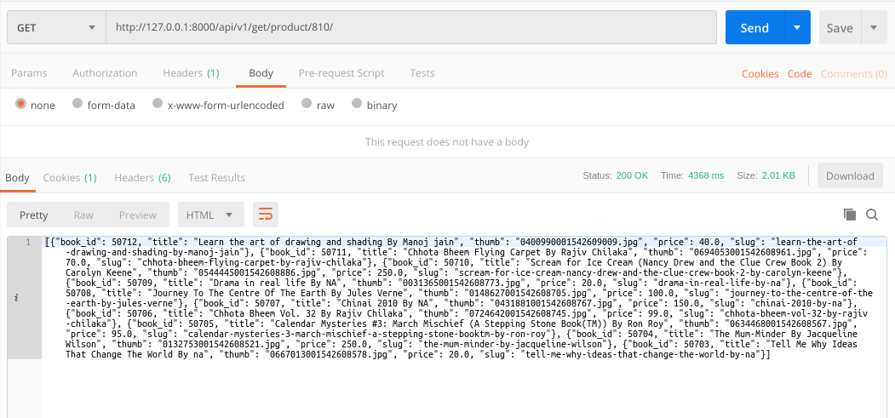

### README- get_productinfo

#### Description-
- This API fetches the product details as well as product condition.
- Product details comprises of book_id, title, slug, thumb, price, publication etc.
- Product condition tells about the different conditions of books avaialable & for each condition it picks up the oldest user & returns the book_inv_id, donor_name, rack_no, shipping **(if available)** , its avatar & the **total no of books available for that particular condition & all the book_inv_id's for that particular condition.**
- It returns data in JSON format.
- GET Method used.

#### API Url-
- In-Stock URL:
  http://127.0.0.1:8000/product/object-oriented-programming-in-turbo-c-in-english

- Out of Stock URL:
  http://127.0.0.1:8000/product/you-can-win

- **IMPORTANT**-
	- **All the below urls will fetch the same output.**
	- http://127.0.0.1:8000/get-books/810/
	- http://127.0.0.1:8000/category/810/
	- http://127.0.0.1:8000/product/810/	
	- *All these urls are dynamically changed by changing the page number, each page gives 10 products as output.*

#### Test Data-
- *No data given as input.*   

#### Output-
- Postman Output 1 (when in stock)

- MySQL Output 1 (when in stock)

- Postman Output 2 (when out of stock)

- Postman Output 3 (for get-books, category, product)

#### AUTHOR-
- **coded by AAYUSH GADIA** 
- **contact info: gadia.aayush@gmail.com**
