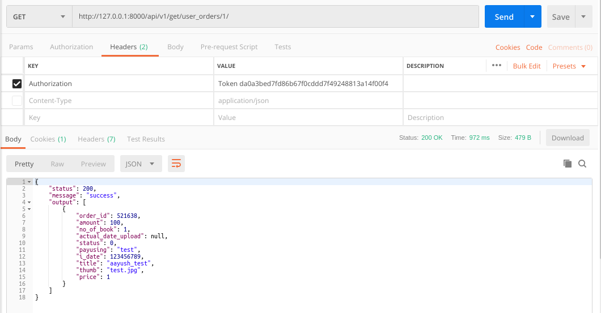
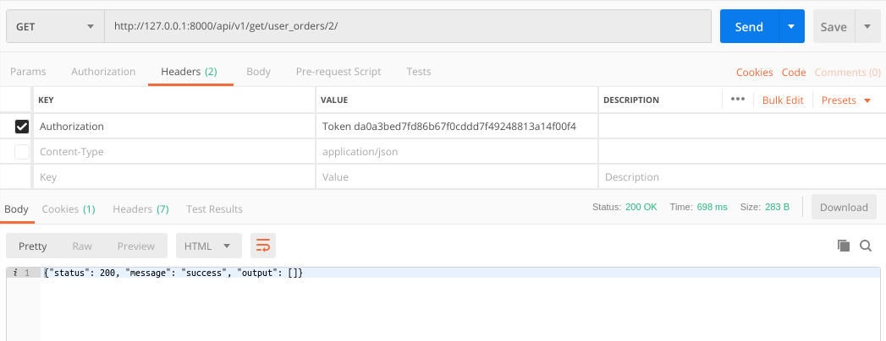

### README- user_orders

#### Description-
- **Fetches i_date, payusing, status, actual_date_upload, amount, order no, no_of_book, book thumb, book title,
book price by joining orders, order_books & books table.**
- **Here the recent orders are showed first.**
- **The data fetched changes dynamically on changing the page number in url.**
- Data is returned in JSON.
- GET Method used.
- Fetched by passing token to the API in headers.
- **The API will work only when the User is Logged in as we are passing token in Headers.**

#### API Url-
- http://127.0.0.1:8000/user_orders/1/
- http://127.0.0.1:8000/user_orders/2/
- Headers: **KEY**- *Authorization*, **VALUE**- *Token 1bf4ba585defdedbc741bde94d0f20a8c4c6eb81*
- The token belonged to **gadia.aayush@gmail.com** login.

#### Test Data-
- No data to pass.

#### Output-
- Postman Output **(when entered a page viz within limits)**

- Postman Output **(when entered a page viz outside limits)**

#### References-
- *ORDER STATUS :: 
   0- processing, 1- complete, 2- cancel, 3- refund, 4- fail, 5- shipping, 6- shippment booked, 7- ready to ship*

#### AUTHOR-
- **coded by AAYUSH GADIA** 
- **contact info: gadia.aayush@gmail.com**