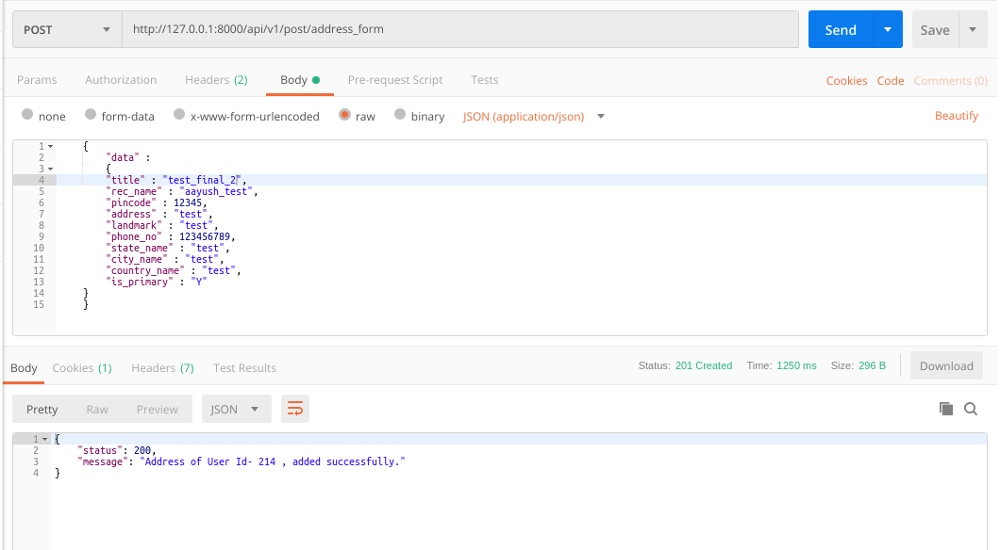
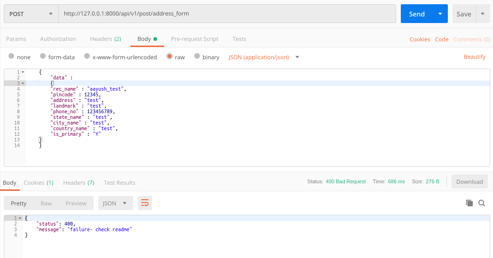

### README- add_address

#### Description-
- This API inserts address details into the *useraddresses* table.
- Data is passed to the API in JSON by frontend application.
- POST Method used.
- Assuming that pincode api is already applied.
- **The API will work only when the User is Logged in as we are passing token in Headers.**

#### API Url-
- http://127.0.0.1:8000/address_form
- Headers: **KEY**- *Authorization*, **VALUE**- *Token 1bf4ba585defdedbc741bde94d0f20a8c4c6eb81*
- The token belonged to **gadia.aayush@gmail.com** login.

#### Test Data-
	{
		"data" :
		{
		"title" : "test_final",
	    "rec_name" : "aayush_test",
	    "pincode" : 12345,
	    "address" : "test",
	    "landmark" : "test",
	    "phone_no" : 123456789,
	    "state_name" : "test",
	    "city_name" : "test",
	    "country_name" : "test",
	    "is_primary" : "Y"
	}
	}

#### Output-
- Postman Output *(when properly data passed)*

- Postman Output *(when improperly data passed)*

- MySQL Output

#### AUTHOR-
- **coded by AAYUSH GADIA** 
- **contact info: gadia.aayush@gmail.com**
