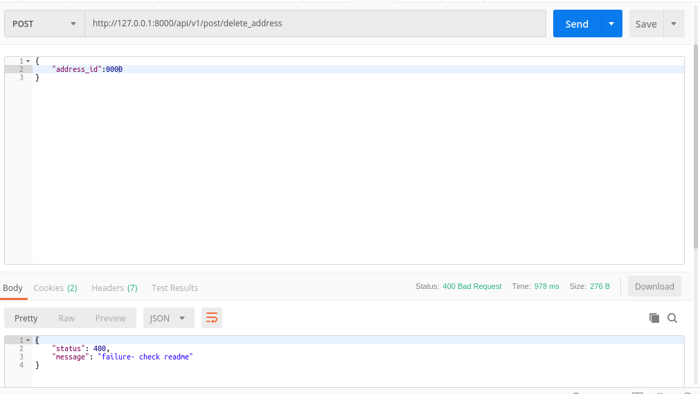

### README- DELETE_ADDRESS

#### Description-
- This API DELETE ADDRESS from the *useraddresses* table.
- Data is passed to the API in JSON by frontend application.
- POST Method used.
- **The API will work only when the User is Logged in as we are passing token in Headers.**

#### API Url-
- http://127.0.0.1:8000/delete_address
- Headers: **KEY**- *Authorization*, **VALUE**- *Token 1bf4ba585defdedbc741bde94d0f20a8c4c6eb81*
- The token belonged to **gadia.aayush@gmail.com** login.

#### Test Data-
	{
	"address_id":1
    }

#### Output-
- Postman Output *(when improperly data passed)*

- Postman Output *(when properly data passed)*

#### AUTHOR-
- **coded by AAYUSH GADIA** 
- **contact info: gadia.aayush@gmail.com**

