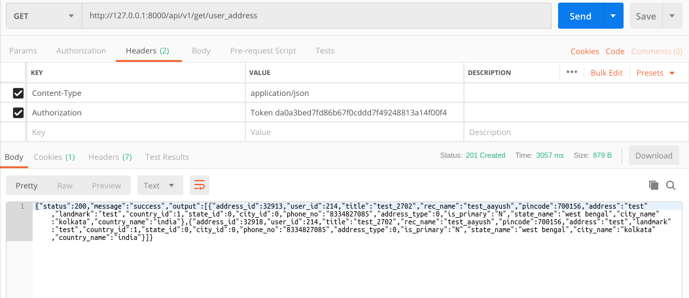

### README- get_address

#### Description-
- This API fetches all the addresses of a user.
- GET Method used.
- Fetched by passing token to the API in headers.
- **The API will work only when the User is Logged in as we are passing token in Headers.**
- Data is returned in JSON.

#### API Url-
- http://127.0.0.1:8000/user_address
- Headers: **KEY**- *Authorization*, **VALUE**- *Token 1bf4ba585defdedbc741bde94d0f20a8c4c6eb81*
- The token belonged to **gadia.aayush@gmail.com** login.

#### Test Data-
- No data to pass.

#### Output-
- Postman Output

#### AUTHOR-
- **coded by AAYUSH GADIA** 
- **contact info: gadia.aayush@gmail.com**

