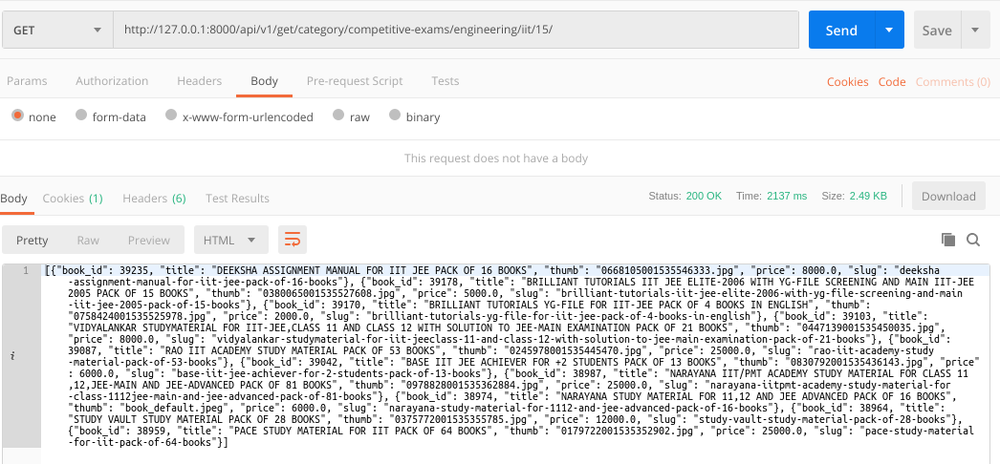

### README- get_books

#### Description-
- Fetches **book_id, title, thumbnail, slug & price of the first 10 products sorted by out_of_stock status & then by upload time.** 
- The **product viz "in stock" & which is uploaded recently is fetched first**.
- The data fetched changes dynamically on changing the page number in url.
- Data is returned in JSON.
- GET Method is used.

#### API Url-
- get-books url:
  http://127.0.0.1:8000/get-books/competitive-exams/engineering/iit/15/

- category url:
  http://127.0.0.1:8000/category/competitive-exams/engineering/iit/15/

- ***Output fetched by both the above Urls are same.***  

- **IMPORTANT**-
	- **All the below urls will fetch the same output.**
	- http://127.0.0.1:8000/get-books/810/
	- http://127.0.0.1:8000/category/810/
	- http://127.0.0.1:8000/product/810/	
	- *All these urls are dynamically changed by changing the page number, each page gives 10 products as output.*

#### Test Data-
- No data to pass

#### Output-
- Postman Output by **get-books**

- Postman Output by **category**

- Postman Output 3 (for get-books, category, product)

#### AUTHOR-
- **coded by AAYUSH GADIA** 
- **contact info: gadia.aayush@gmail.com**
